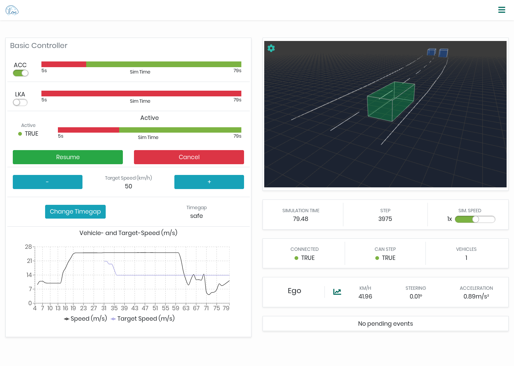

Eclipse Cloe
============

Cloe empowers developers of automated-driving software components by providing
a unified interface to closed-loop simulation. It achieves this by abstracting
over environment and vehicle simulators and building upon these.



Cloe isn't a single tool. It is a set of components written in different
languages employing different tools that work together:

 - Cloe runtime & engine (C++)
 - Cloe command line interface (Python)
 - Cloe web user interface (Javascript/React)

Contributing to the CLI and the UI is pretty straightforward, as these are
tools that live more-or-less 100% in their respective subdirectories. The
runtime and engine are a different story though.

Cloe is meant to be extended through plugins that build on the Cloe runtime and
are integrated at runtime by the Cloe engine. These are written in C++, which
doesn't have a defacto method of packaging. Finding a solution for integrating
C++ packages is always going to be a trade-off between ease-of-use for
developers and users. In our experience, it is better to require more from
developers than from users, as demanding too much from users usually ends up
backfiring with increased support issues.

Getting Started
---------------

For in-depth documentation, see our [website](https://cloe.readthedocs.io).

For building, deploying, and running the runtime and engine we use [Conan][1],
a modern C++ package manager. We currently have not published any Conan
packages that can be downloaded directly. Building them yourself is pretty
straightforward.

Currently, we only support Linux or [WSL][2].

### Installing Dependencies

We provide automatic dependency installation for [Ubuntu][3] from 18.04 to 22.04
via the `Makefile.setup` Makefile. You should inspect it before
running the targets, as these will modify your system.
Other distributions may work, if the packages are available.

    git clone https://github.com/eclipse/cloe.git
    cd cloe
    sudo make install-system-deps
    make install-python-deps

You may need to setup your Conan profile before continuing on to the next
point. In a pinch, the following steps should suffice:

 1. Install Conan with Python.
    ```
    pip3 install --user --upgrade "conan<2.0.0"
    ```
 2. Define a Conan profile, which defines the machine configuration.
    ```
    conan profile new --detect default
    conan profile update settings.compiler.libcxx=libstdc++11 default
    conan profile update settings.build_type=RelWithDebInfo default
    ```
    If everything works out, your Conan profile should look *something like* this.
    ```console
    $ conan profile show default
    Configuration for profile default:
    [settings]
      os               = Linux
      os_build         = Linux
      arch             = x86_64
      arch_build       = x86_64
      compiler         = gcc
      compiler.version = 9
      compiler.libcxx  = libstdc++11
      build_type       = RelWithDebInfo
    ```

See the Conan [documentation][6] for more information on how to do this.

### Building the Cloe Packages

To build all packages, you should run the following:

    make package

This will export all Conan recipes from this repository and create the cloe
package. Conan will download and build all necessary dependencies. Should
any errors occur during the build, you may have to force Conan to build
all packages instead of re-using packages it finds:
```
    make package CONAN_OPTIONS="--build"
```
Run `make help` to get an overview of the available targets we expect you to
use. For more details on how this is done, have a look at the Makefiles in the
repository root.

If you experience timeout issues waiting for Conan Center, you can slightly
increase Conan's timeout configuration like so:

    export CONAN_REQUEST_TIMEOUT=360

### Running Cloe

Since Cloe is made up of many packages, running the Cloe engine directly is
somewhat tricky. Conan provides the `virtualrunenv` generator, which creates
shell scripts that you can source, similar to Python's virtualenv. Or, you can
use the `cloe-launch` tool, in the `cli` directory, which wraps all this
functionality for you in one convenient place.

You can install `cloe-launch` with `pipx` (or `pip`), but we recommend you just
use the make target:

    make deploy-cli

If you want to install it in editable mode, you can use:

    make -C cli editable

This has the advantage that any updates to the repository will be transparently
used.

Once the `cloe-launch` tool is available, you can do one of the following:

 1. Launch a shell with the environment adjusted:
    <!-- TODO: Update this example!! -->
    ```console
    $ cloe-launch -v shell tests/conanfile_default.py
    Source profile: tests/conanfile_default.py
    Profile name: 7745ffb0e036192c8e29a8b8cc2b9571e7a72c8c
    Configuration:
        ...
    Runtime directory: /home/captain/.cache/cloe/launcher/7745ffb0e036192c8e29a8b8cc2b9571e7a72c8c
    Exec: conan install --install-folder /home/captain/.cache/cloe/launcher/7745ffb0e036192c8e29a8b8cc2b9571e7a72c8c -g virtualenv -g virtualrunenv tests/conanfile_default.py
    Exec: /bin/bash -c source /home/captain/.cache/cloe/launcher/7745ffb0e036192c8e29a8b8cc2b9571e7a72c8c/activate_run.sh &>/dev/null && env
    Exec: /bin/bash -c source /home/captain/.cache/cloe/launcher/7745ffb0e036192c8e29a8b8cc2b9571e7a72c8c/activate_all.sh &>/dev/null && env

    [cloe-shell] $ cloe-engine usage
    Cloe 0.19.0 (2022-11-21)
    ...
    ```
 2. Launch `cloe-engine` directly:
    <!-- TODO: Update this example!! -->
    ```console
    $ cloe-launch -v exec conanfile.py -- usage
    Source profile: tests/conanfile_default.py
    Profile name: 7745ffb0e036192c8e29a8b8cc2b9571e7a72c8c
    Configuration:
        ...
    Runtime directory: /home/captain/.cache/cloe/launcher/7745ffb0e036192c8e29a8b8cc2b9571e7a72c8c
    Exec: conan install --install-folder /home/captain/.cache/cloe/launcher/7745ffb0e036192c8e29a8b8cc2b9571e7a72c8c -g virtualenv -g virtualrunenv tests/conanfile_default.py
    Exec: /bin/bash -c source /home/captain/.cache/cloe/launcher/7745ffb0e036192c8e29a8b8cc2b9571e7a72c8c/activate_run.sh &>/dev/null && env
    Exec: /bin/bash -c source /home/captain/.cache/cloe/launcher/7745ffb0e036192c8e29a8b8cc2b9571e7a72c8c/activate_all.sh &>/dev/null && env
    Exec: /home/captain/.conan/data/cloe-engine/0.19.0/cloe/develop/package/218a01b0a23497c52f95fbb0967b2d6b1d9ac1e4/bin/cloe-engine usage
    ---
    Cloe 0.19.0 (2022-11-21)
    ...
    ```

Note that the above examples show the verbose output of the `cloe-launch` tool.

### Running Tests

Integration and system tests can be run to ensure that all the packages built
are working together as expected:

    make smoketest-deps
    make smoketest

This will build packages in the required configurations as defined by the
profiles in the `tests` directories in the various packages. Then it will
run all available BATS tests with each of the profiles.

Unit tests are compiled and run during the build step of each package, so
this shouldn't need to be performed manually.

See the documentation on testing Cloe for more details.

### Building Docker Images

The `Dockerfile` provided in the repository root can be used to create one
or more Docker images. These can be used as devcontainers or simply to
create Conan packages in a reproducible environment.

The `Makefile.docker` contains multiple targets to build, test, and
release Docker images for the current Cloe version in the repository.
Run `make -f Makefile.docker help` to get an impression of what is possible:

    $ make -f Makefile.docker help
    Usage: make target

    Available Docker targets:
      all                   build and test all Ubuntu versions
      ubuntu-VERSION        build and test the Ubuntu VERSION image
      build-all             build all Ubuntu versions
      build-ubuntu-VERSION  build the Ubuntu VERSION image
      test-all              build all Ubuntu versions
      test-ubuntu-VERSION   test the Ubuntu VERSION image
      run-ubuntu-VERSION    run the Ubuntu VERSION image
      release-all           release all Ubuntu versions
      release-ubuntu-VERSION release the Ubuntu VERSION image
      remove-current-images remove and prune all cloe/cloe-engine:0.19.0 Docker images
      remove-all-images     remove and prune all cloe/cloe-engine Docker images

    User configuration:
        CONAN_PROFILE=
        PACKAGE_TARGET=
        KEEP_SOURCES=
        DOCKER_USER_ARGS=

    Docker configuration:
        UBUNTU_NAME=ubuntu
        UBUNTU_VERSIONS=\
          18.04
          20.04
          22.04
        DOCKER=DOCKER_BUILDKIT=1 docker
        DOCKER_CONTEXT=/home/captain/cloe
        DOCKER_NETWORK=host
        DOCKER_IMAGE=cloe/cloe-engine:0.19.0
        DOCKER_BUILD_ARGS=\
          --build-arg PROJECT_VERSION=0.19.0
        DOCKER_RUN_ARGS=\
          -it
          --rm

Because Docker images may be built in environments that have a proxy running,
the Makefile will automatically add the proxy variables if they are are
detected in the host environment.

The section `User configuration` shows variables that can be set to modify
the resulting Docker image; if they are empty here, then the defaults in
the `Dockerfile` are used, which should suffice for most use-cases.

If you want to use a different Conan remote from the default, you need to
copy `setup.sh.example` to `setup.sh` and modify the values to match your
environment.

Note that this build requires the use of docker buildx, which has been
available for some time. This allows us to mount secrets in at build time
and also speeds up the build by the strategic use of caches.

[1]: https://conan.io
[2]: https://docs.microsoft.com/en-us/windows/wsl/about
[3]: https://ubuntu.com
[5]: https://github.com/conan-io/conan-center-index/issues/950
[6]: https://docs.conan.io/en/latest/
