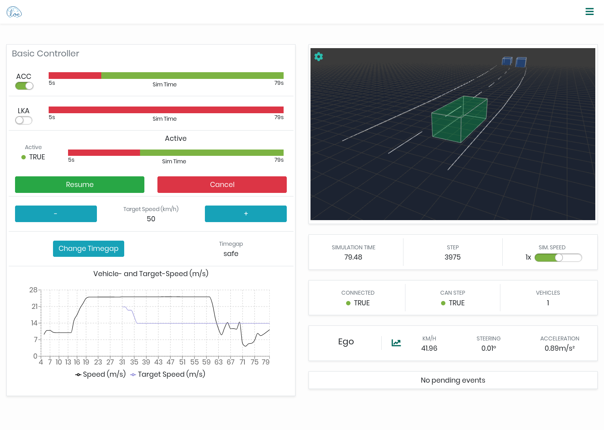

Eclipse Cloe
============

Cloe empowers developers of automated-driving software components by providing
a unified interface to closed-loop simulation. It achieves this by abstracting
over environment and vehicle simulators and building upon these.



Cloe isn't a single tool. It is a set of components written in different
languages employing different tools that work together:

 - Cloe runtime & engine (C++)
 - Cloe command line interface (Python)
 - Cloe web user interface (Javascript/React)

Contributing to the CLI and the UI is pretty straightforward, as these are
tools that live more-or-less 100% in their respective subdirectories. The
runtime and engine are a different story though.

Cloe is meant to be extended through plugins that build on the Cloe runtime and
are integrated at runtime by the Cloe engine. These are written in C++, which
doesn't have a defacto method of packaging. Finding a solution for integrating
C++ packages is always going to be a trade-off between ease-of-use for
developers and users. In our experience, it is better to require more from
developers than from users, as demanding too much from users usually ends up
backfiring with increased support issues.

Getting Started
---------------

For building, deploying, and running the runtime and engine we use
[Conan](https://conan.io), a modern C++ package manager. We currently have not
published any Conan packages that can be downloaded directly.
Building them yourself is pretty straightforward.

Currently, we only support Linux or WSL.

### Installing Dependencies

We provide automatic dependency installation for Ubuntu und Archlinux
via the `Makefile.setup` Makefile. You should inspect it before
running the targets, as these will modify your system.
Other distributions may work, if the packages are available.

    git clone https://github.com/eclipse/cloe.git
    cd cloe
    sudo make install-system-deps
    make install-python-deps

You may need to setup your Conan profile before continuing on to the next
point. In a pinch, the following steps should suffice:

 1. Install Conan with Python.
    ```console
    $ pip3 install --user --upgrade conan
    Collecting conan
    ...
    Successfully built conan
    Installing collected packages: conan
      Attempting uninstall: conan
        Found existing installation: conan 1.28.1
        Uninstalling conan-1.28.1:
          Successfully uninstalled conan-1.28.1
    Successfully installed conan-1.29.0
    ```
 2. Define a Conan profile, which defines the machine configuration.
    ```console
    $ conan profile new --detect default
    $ conan profile update settings.compiler.libcxx=libstdc++11 default
    $ conan profile show default
    Configuration for profile default:
    [settings]
      os               = Linux
      os_build         = Linux
      arch             = x86_64
      arch_build       = x86_64
      compiler         = gcc
      compiler.version = 9
      compiler.libcxx  = libstdc++11
      build_type       = Release
    ```

See the Conan documentation for more information on how to do this.

### Building the Cloe Packages

To build all packages, you should run the following:

    make export packages

This will export Conan recipes for some of our dependencies and build the
packages that are contained in the repository.

For more details on how this is done, have a look at the Makefiles in the
repository root.

### Running Cloe

Since Cloe is made up of many packages, running the Cloe engine directly is
somewhat tricky. Conan provides the `virtualrunenv` generator, which creates
shell scripts that you can source, similar to Python's virtualenv. Or, you can
use the `cloe-launch` tool, in the `cli` directory, which wraps all this
functionality for you in one convenient place.

You can install an editable instance with `pipx` (or `pip`):

    pipx install -e .

This has the advantage that any updates to the repository will be transparently
used.

Once the `cloe-launch` tool is available, you can do one of the following:

 1. Launch a shell with the environment adjusted:
    ```console
    $ cloe-launch -v shell -P conanfile.py
    Source profile: conanfile.py
    Profile name: 5990582c3331e43d46d7e40f293a53b76063f1e4
    Configuration:
        ...
    Runtime directory: /home/mog2abt/.cache/cloe/launcher/5990582c3331e43d46d7e40f293a53b76063f1e4
    $ cloe-engine usage
    Cloe 0.18.0-nightly (2020-10-01)
    ...
    ```
 2. Launch `cloe-engine` directly:
    $ cloe-launch -v exec -P conanfile.py -- usage
    Source profile: conanfile.py
    Profile name: 5990582c3331e43d46d7e40f293a53b76063f1e4
    Configuration:
        ...
    Runtime directory: /home/mog2abt/.cache/cloe/launcher/5990582c3331e43d46d7e40f293a53b76063f1e4
    ---
    Cloe 0.18.0-nightly (2020-10-01)
    ...
    ```
