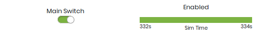
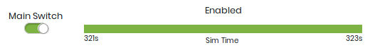
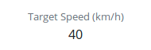
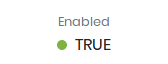
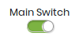
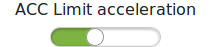
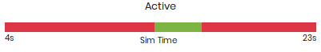
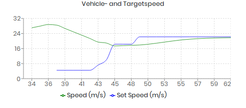
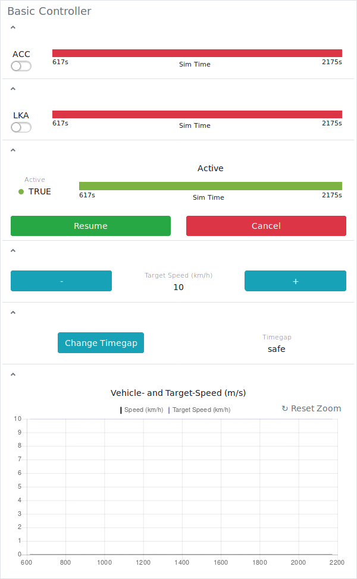

Dynamic Card Interface
======================

Cloe-UI offers the possibility to add a customized *card* (an HMI component, so
to speak) for each controller. The elements of the component have to be
specified and served in the JSON format. It is possible to add input and output
elements, such as buttons, linecharts, and simple state indicators.

JSON Specification
------------------

The main JSON Object is called ``controller``.
It contains four properties which describe the UI Component:

- "title"
- "action"
- "paths"
- "elements"
- "layout"

.. code-block:: json

    {
        "controller": {
            "title": "Controllername",
            "action": "$CONTROLLER/hmi",
            "paths": {},
            "elements": [],
            "layout": {}
        }
    }

"title"
"""""""
The ``name`` property has to be a string with the controller name which will be
displayed at the top of the UI Component.

"action"
""""""""
The ``action`` property defines a default action for elements which are able to
insert a cloe trigger into the simulation (``switch``, ``button`` and
``slider``). You can use the ``$CONTROLLER`` variable which will be replaced
by Cloe-UI with the name of the controller.

"paths"
"""""""
The ``path`` property includes the default source path of cloe's JSON API which
should be used by the elements of the HMI component to get information of.

You can use the ``$CONTROLLER`` variable which will be replaced
by Cloe-UI with the name of the controller.

.. code-block:: json

    {
        "paths": {
            "source": "/$CONTROLLER/state"
        }
    }

"elements"
""""""""""
``elements`` is an array of JSON Objects which are describing the HMI
component's elements.

Each element has a set of properties. Which properties are required is
depending on the element's type.

.. code-block:: json

    {
        "elements": [
            {
                "id": "l-enabled",
                "type": "led_label",
                "source": { "path": "/cloe/controllers/1/state", "name": "enabled" },
                "title": "Enabled"
            },
            {
                "id": "l-active",
                "type": "led_label",
                "source": { "path": "/cloe/controllers/1/state", "name": "active" },
                "title": "Active"
            }
        ]
    }

"id"
....
The ``id`` property has to have a string as value. It is the unique
identifier of the element which will be used in the definition of the
UI Component's layout.

This property is required by all element types.

"title"
.......
The ``title`` property has to have a string as value. In all elements
it will be displayed directly, e.g. as a headline.

This property is not required explicitly, but we recommend to set it
for every element.

"source"
........
The ``source`` property's value can be either a JSON object which describes
a single data source, or an array of data sources, each described by an
own JSON Object.

.. code-block:: json

    {
        "source": [
            {
                "endpoint": "/cloe/controllers/1/state/hmi",
                "path": "driver_door_closed",
                "name": "Driver Door"
            },
            {
                "endpoint": "/$CONTROLLER/state/hmi"
                "path": "passenger_door_closed",
                "name": "Passenger Door"
            },
            {
                "path": "$.target_speed"
                "name": "Target Speed",
                "math": "x * ((60 * 60) / 1000)"
            }
        ]
    }

The ``source`` property is required by element types which represent data:

- ``label``
- ``led_label``
- ``switch``
- ``timebar``
- ``linechart``

A source object contains up to four properties:

"endpoint"
++++++++++
This property defines the API endpoint where the data lives.
The value has to be a string. If you don't know how the endpoints
for your controller are named by cloe, use the ``$CONTROLLER`` variable.
Cloe UI will resolve it automatically for your controller.

If the endpoint for the source it is not set, Cloe UI will use the default
endpoint defined in the ``paths`` section.

"path"
++++++
This property defines the path of the resource on the endpoint.

Use the JSONPath syntax: https://github.com/dchester/jsonpath

"name"
++++++
The name property's value is a string which describes the data source.

This property is not required explicitly, but some element types (linechart)
will display it directly if it is set.

"math"
++++++
With the math property it is possible to apply a mathematical calculation on
the source's value. The source's value is represented by ``x``.

"action"
........
The ``action`` property's value is a JSON object which describes a cloe action,
just as a trigger in a cloe-run yaml file. The declared action will be executed
when the element gets used, e.g. the switch or button gets clicked on.

With the ``name`` property of ``action``, you can define which action will be
used. If no action is defined, the default ``action`` value declared on the top
level of the controller ui definition will be used.

As value for the selected action, you can either use the variable ``$STATE``.
This will cause switch elements to use a value dependent on the state of the
elements's source. If ``$STATE`` is used on button elements, the action will
use a ``true`` value on the click, and ``false`` on release of the button.

If you are not sure about what value to use on your action, use ``$STATE``.

.. code-block:: json

    {
        "action": {
            "name": "$CONTROLLER/hmi"
            "enable": "$STATE"
        }
    }

The ``action`` property is required by element types which trigger
HMI functions:

- ``button``
- ``switch``
- ``slider``

"params"
........
With the ``params`` property it is possible to hand over element
specific settings. Which params can be used at each element type
is described at the type's section.

There's one parameter which can be used with every
element type: ``fitted_width``.

If it's value is set to ``true``, the element will use just as much
space in the ui as it needs. If it's set to ``false`` (default),
the total space will be distributed equally among the elements.

Example
+++++++
Switch element with ``fitted_width``: false:

Switch element with ``fitted_width``: true:

"type"
......

Each element has a type which defines it's appearance
and functionality.

Output Types:
- ``label``
- ``led-label``
- ``button``
- ``switch``
- ``timebar``
- ``linechart``

Input Types:
- ``button``
- ``switch``

"label"
+++++++
The element type ``label`` is a simple element to display a single
information like a string, a boolean value or a number.

The label element requires the ``source`` property to get it's data.

.. code-block:: json

    {
        "id": "l-timeGap",
        "type": "label",
        "title": "Timegap",
        "source": {
            "path": "/cloe/controllers/1/state",
            "name": "distance_algorithm"
        }
    }

"led_label"
+++++++++++
``led_label`` is a variant of ``label``. It's speciality is that
it accepts only boolean values as input, so the source has to point
to a boolean value. It has an additional 'LED light' which indicates
the current value.

.. code-block:: json

    {
        "id": "l-enabled",
        "type": "led_label",
        "title": "Enabled",
        "source": {
            "path": "/cloe/controllers/1/state",
            "name": "enabled"
        }
    }

"button"
++++++++
The button element can be used to trigger one or more HMI buttons.

Button is primary an HMI input element, therefore it needs
an ``action`` property.

On the other hand it can also be used as an output. If a source is
defined which points on a boolean value, the button will change it's
style depending on the source value. Therefore it needs parameters set
for the default style (true) and the alternative style (false).

.. code-block:: json

    {
        "id": "bt-resume",
        "type": "button",
        "title": "Resume",
        "action": { "resume": "$STATE" },
        "source": { "path": "/cloe/controllers/1/state", "name": "active" },
        "params": {
            "default_style": "outline-success",
            "alt_style": "danger"
        }
    }

"switch"
++++++++
The switch is an input/output element. It's appearance represents a boolean
value and a click on it will trigger the HMI.

Therefore the element needs the ``source`` and ``action`` properties to be set.

.. code-block:: json

    {
        "id": "sw-main",
        "type": "switch",
        "title": "Main Switch",
        "action": {
            "enable": "$STATE"
        },
        "source": {
            "endpoint": "/$CONTROLLER/state/hmi",
            "path": "main"
        },
        "params": {
            "fitted_width": true
        }
    }

"slider"
++++++++
The slider is an input/output element. It's appearance represents a numerical
value and changing it's position will trigger the hmi accordingly.

Therefore the element needs the ``source`` and ``action`` properties to be set.

.. code-block:: json

    {
        "id": "sl-acc-limit-acceleration",
        "type": "slider",
        "target": {
            "endpoint": "/$CONTROLLER/configuration/acc",
            "path": "limit_acceleration"
        },
        "source": {
            "endpoint": "/$CONTROLLER/configuration",
            "path": "acc.limit_acceleration"
        },
        "title": "ACC Acceleration Limit",
        "params": {
            "fitted_width": true,
            "minValue": 0,
            "maxValue": 50,
            "stepWidth": 0.5
        }
    }

"timebar"
+++++++++
A timebar element is an indicator for the changes of a boolean value over
the simulation time. In this example, the timebar shows that the controller
was disabled at the start of the simulation and got enabled after a few seconds.

The timebar element requires the ``source`` property to be set and pointing to
a boolean value.

The colors of the timebar and the Label on the x-axis can be set with
the ``params`` property.

.. code-block:: json

    {
        "id": "tb-enabled",
        "title": "Enabled",
        "type": "timebar",
        "source": { "name": "enabled" },
        "params": {
            "x_label": "Sim Time",
            "color_true": "green",
            "color_false": "red"
        }
    }

"linechart"
+++++++++++
The linechart takes a numeric value and renders a simple chart with the
simulation time on the x-axis and the numeric value on the y-axis.

The linechart element requires the "source" property do be set with a single
source object or an array of source objects. If an array of multiple source
objects is specified, the element will render a line for each source.
All sources have to point to numeric values.

As parameters the linechart element will accept a color for the line or an
array of colors in case that multiple sources are defined.

.. code-block:: json

    {
        "id": "lc-vehicle",
        "title": "Achievable Realtime Factor",
        "type": "linechart",
        "source": [
            {
                "path": "/cloe/simulation/state",
                "name": "achievable_realtime_factor"
            },
            {
                "path": "/cloe/simulation/state",
                "name": "speed"
            }
        ],
        "params": {
            "colors": ["black", "#8884d7"]
        }
    }

"layout"
""""""""
With the layout object you can arrange the defined elements.
There are two properties:

"type"
......
Currently the only supported layout type is ``grid``.

"groups"
........
The ``groups`` property is a representation of the grid layout.
For each element group you have to specify an object with the
four properties, ``name``, ``visibility_toggle``, ``columns`` and ``elements``.

The ``name`` property definies a string which will be displayed at top of the
group.
The ``visibility_toggle`` property is a boolean value which indicates the
initial visibility of the component. The default value is ``true``.
The ``columns`` property defines how many elements a row in the grid will
include, the ``elements`` property is an array with element id's.

.. code-block:: json

    {
        "layout": {
            "type": "grid",
            "groups": [
                {
                    "columns": 2,
                    "elements": ["sw-main", "tb-enabled"],
                    "name": "Main",
                    "visibility_toggle": false
                },
                {
                    "columns": 2,
                    "elements": ["l-any-active", "tb-active"],
                    "name": "Active"
                },
                {
                    "columns": 3,
                    "elements": ["bt-resume", "bt-cancel", "bt-plus-minus"]
                },
                {
                    "columns": 3,
                    "elements": [
                        "bt-minus",
                        "l-fct-set-speed",
                        "bt-plus",
                        "bt-timegap-minus",
                        "l-fct-timegap",
                        "bt-timegap-plus"
                    ]
                }
            ]
        }
    }

Full Example
------------

UI
""

Specification
"""""""""""""

.. code-block:: json

    {
        "controller": {
            "action": "$CONTROLLER/hmi",
            "title": "Basic Controller",
            "paths": {
                "source": "/$CONTROLLER/state"
            },
            "elements": [
                {
                    "id": "sw-power",
                    "title": "ACC",
                    "type": "switch",
                    "action": {
                        "enable": "$STATE"
                    },
                    "source": {
                        "endpoint": "/$CONTROLLER/state",
                        "path": "enabled"
                    },
                    "params": {
                        "fitted_width": true
                    }
                },
                {
                    "id": "l-active",
                    "type": "led_label",
                    "source": {
                        "path": "active"
                    },
                    "title": "Active",
                    "params": {
                        "fitted_width": true
                    }
                },
                {
                    "id": "l-targetspeed",
                    "type": "label",
                    "source": {
                        "endpoint": "/$CONTROLLER/state",
                        "path": "target_speed"
                    },
                    "title": "Target Speed (km/h)"
                },
                {
                    "id": "l-timegap",
                    "type": "label",
                    "source": {
                        "endpoint": "/$CONTROLLER/state",
                        "path": "distance_algorithm"
                    },
                    "title": "Timegap",
                    "params": {
                        "fitted_width": true
                    }
                },
                {
                    "id": "sw-lka",
                    "title": "LKA",
                    "type": "switch",
                    "action": {
                        "lka": "$STATE"
                    },
                    "source": {
                        "endpoint": "/$CONTROLLER/hmi",
                        "path": "lka"
                    },
                    "params": {
                        "fitted_width": true
                    }
                },
                {
                    "id": "bt-resume",
                    "type": "button",
                    "title": "Resume",
                    "action": {
                        "resume": "$STATE"
                    },
                    "params": {
                        "default_style": "success"
                    }
                },
                {
                    "id": "bt-cancel",
                    "type": "button",
                    "title": "Cancel",
                    "action": {
                        "cancel": "$STATE"
                    },
                    "params": {
                        "default_style": "danger"
                    }
                },
                {
                    "id": "bt-plus",
                    "type": "button",
                    "title": "+",
                    "action": {
                        "plus": "$STATE"
                    },
                    "params": {
                        "default_style": "info"
                    }
                },
                {
                    "id": "bt-minus",
                    "type": "button",
                    "title": "-",
                    "action": {
                        "minus": "$STATE"
                    },
                    "params": {
                        "default_style": "info"
                    }
                },
                {
                    "id": "bt-timegap",
                    "type": "button",
                    "title": "Change Timegap",
                    "action": {
                        "distance": "$STATE"
                    },
                    "params": {
                        "default_style": "info",
                        "fitted_width": true
                    }
                },
                {
                    "id": "tb-active",
                    "title": "Active",
                    "type": "timebar",
                    "source": {
                        "path": "active"
                    },
                    "params": {
                        "x_label": "Sim Time",
                        "color_true": "#7cb342",
                        "color_false": "#dc3545"
                    }
                },
                {
                    "id": "tb-enabled",
                    "type": "timebar",
                    "source": {
                        "path": "enabled"
                    },
                    "params": {
                        "x_label": "Sim Time",
                        "color_true": "#7cb342",
                        "color_false": "#dc3545"
                    }
                },
                {
                    "id": "tb-lka",
                    "type": "timebar",
                    "source": {
                        "endpoint": "/$CONTROLLER/configuration",
                        "path": "$.lka.enabled"
                    },
                    "params": {
                        "x_label": "Sim Time",
                        "color_true": "#7cb342",
                        "color_false": "#dc3545"
                    }
                },
                {
                    "id": "lc-vehicle",
                    "title": "Vehicle- and Target-Speed (m/s)",
                    "type": "linechart",
                    "source": [
                        {
                            "endpoint": "/$CONTROLLER/vehicle",
                            "path": "$.components['cloe::default_ego_sensor'].sensed_state.velocity_norm",
                            "name": "Speed (km/h)",
                            "math": "x * ((60 * 60) / 1000)"
                        },
                        {
                            "path": "$.target_speed_mps",
                            "name": "Target Speed (km/h)",
                            "math": "x * ((60 * 60) / 1000)"
                        }
                    ],
                    "params": {
                        "colors": ["black", "#8884d7"]
                    }
                }
            ],
            "layout": {
                "type": "grid",
                "groups": [
                    {
                        "columns": 2,
                        "elements": ["sw-power", "tb-enabled"]
                    },
                    {
                        "columns": 2,
                        "elements": ["sw-lka", "tb-lka"]
                    },
                    {
                        "columns": 2,
                        "elements": [
                            "l-active",
                            "tb-active",
                            "bt-resume",
                            "bt-cancel"
                        ]
                    },
                    {
                        "columns": 3,
                        "elements": ["bt-minus", "l-targetspeed", "bt-plus"]
                    },
                    {
                        "columns": 2,
                        "elements": ["bt-timegap", "l-timegap"]
                    },

                    {
                        "columns": 1,
                        "elements": ["lc-vehicle"]
                    }
                ]
            }
        }
    }
