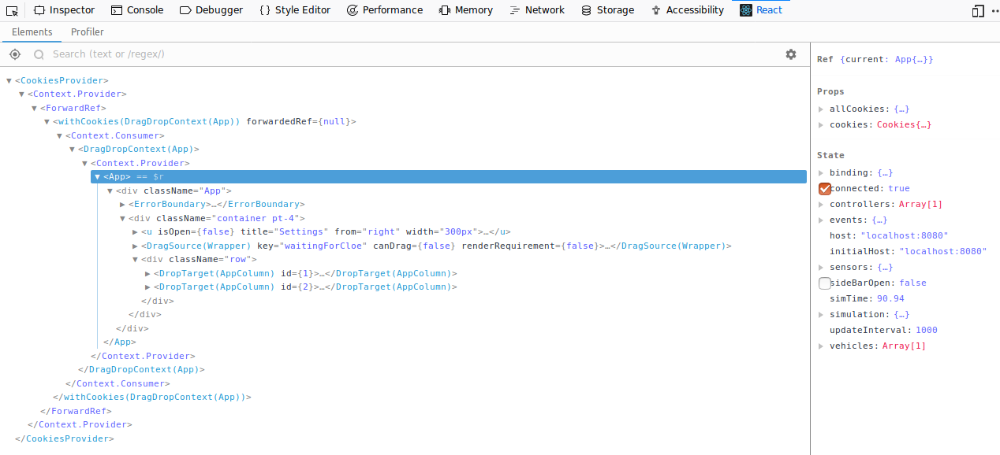
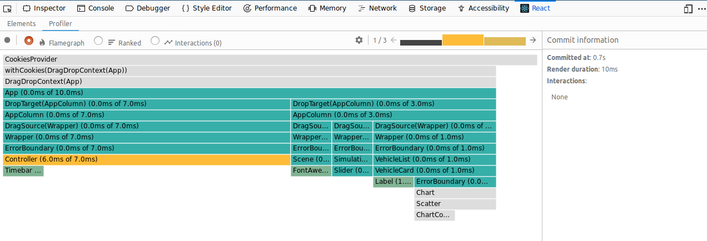

Getting Started
===============

.. highlight:: bash

Local installation of the UI is needed if you want to work on the UI itself.
If all you are interested in is running the UI, please use the Docker
container.

Make sure that you have access to the Git repository and then clone it with::

    git clone git@github.com:eclipse/cloe.git

Installing Dependencies
-----------------------

All dependencies for third party packages are specified in the ``package.json``
file. Switch into the working directory and install the npm packages with
the npm package manager::

    cd cloe/ui
    npm install

.. note::
   npm is a package manager and is distributed with the Javascript
   runtime environment Node.js_. Download and install the latest LTS
   version of Node.js_.

   Please make sure that the npm proxy configuration allows you to install
   packages from external sources.

You can add third party packages with npm::

    npm install -s package_name

This will automatically add them to the ``package.json`` as a dependency.

.. _Node.js: https://nodejs.org/en/

Starting the App
----------------

To start the web-app in development mode, execute::

    npm start

This will serve the web-app on localhost:3000.

To create an optimized production build, execute::

    npm run build

This will create a ``build/`` directory with optimized, static files.
You can serve them with the npm package ``serve``::

    npm install -g serve
    serve -s app

Packing and Distributing
------------------------

The Cloe UI is distributed as a Docker container.
Several make targets are defined to ease this process.

1. An image can be built with::

      make image

2. An image can be built and pushed to a container registry with::

      make release

.. note::
   The build may stall due to the default Ubuntu open-file-limit of 1024.
   Increase ulimit like described here: https://superuser.com/a/1200818

React Developer Tools
---------------------

React offers browser plugins for Firefox_ and Chrome_ which are very helpful
for debugging React apps.

If you run the web-app in development mode, you can access the React Developer
Tools from within your Browser's developer tools, which you can start with the
``F12`` key.

The React Developer Tools consist of two main tools: Elements and Profiler.

Elements
^^^^^^^^

Accessible via the Elements tab:

With this tool, you have access to the component tree of the React App.
Select a component to see it's current props and state on the right side of the
screen.

If an component is selected, you can access it on the browser console with
``$r``.

Profiler
^^^^^^^^

Accessible via the Profiler tab:

With this tool, you can measure the rendering performance of your App and
its individual components.

.. _Firefox: https://addons.mozilla.org/firefox/addon/react-devtools/
.. _Chrome: https://chrome.google.com/webstore/detail/react-developer-tools/fmkadmapgofadopljbjfkapdkoienihi
