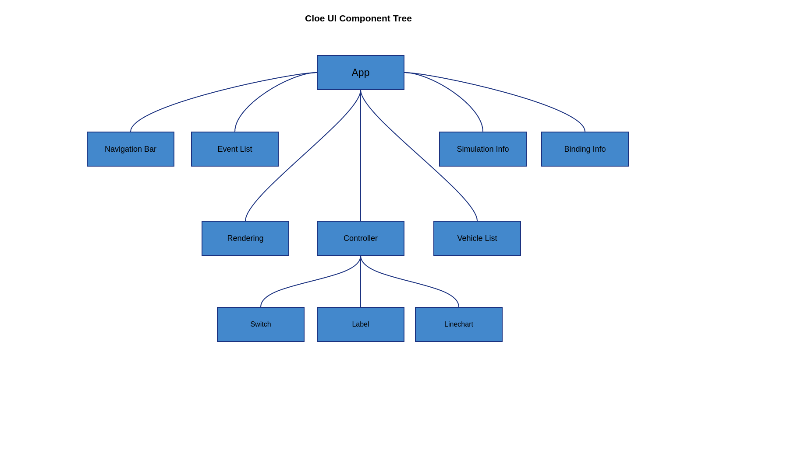

Reference
=========

The Cloe UI is based on ReactJs_. React is an open-source JavaScript library
for building user interfaces. A React-based UI is composed out of *components*.
Each component is able to contain it's own state and React will re-render the
component if this state changes, so you don't have to update the DOM by
yourself. The Cloe UI is composed of many such components.

.. hint::

   I can recommend this tutorial_ to learn the basics of React. Also the official
   documentation_ is a good starting point to dive into this topic.
   Additionally, you will find a very helpful compilation of React-related
   tips, patterns and other stuff here_.

.. _ReactJs: https://reactjs.org/
.. _tutorial: https://www.youtube.com/watch?v=Ke90Tje7VS0
.. _documentation: https://reactjs.org/docs/getting-started.html
.. _here: https://github.com/vasanthk/react-bits

The following diagram is an approximation of the basic structure of the Cloe
UI.

.. todo::
   The following topics should be described:

    - Vision for Cloe UI
    - Current Problems
    - Possible Improvements

.. toctree::
   :maxdepth: 1
   :caption: Components:

   reference/app
   reference/controller
   reference/rendering
   reference/simulation
   reference/binding
   reference/vehicles
   reference/events
