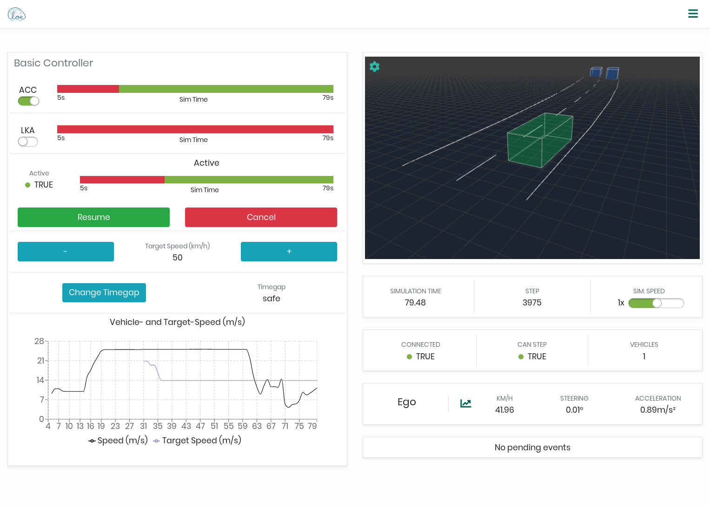

Cloe
====

These are the TODOs that need to be fixed before we can open source.
You can also search the repository for ``.. todo::`` to get a list
that you can use in your editor.

.. todolist::

----

Cloe empowers developers of automated-driving software components by providing
a unified middleware interface to closed-loop simulation. It achieves this by
abstracting over environment and vehicle simulators and building upon these.

Using these abstractions, it is then possible to provide features such as the
following:

- Support for alternate simulators
- Testing with perfect ground-truth sensor data
- Phenomenological sensor models and fault-injection
- Dynamic and scripted event injection via trigger system
- Easy integration in continuous integration environments via Docker
- Access to running simulations via REST-based JSON API
- Visualization of function and simulation state via HTML5 and Javascript
- Simulation speed adjustments and debugging of system-under-test

Cloe aims to make it easy for developers to create a *controller plugin* that
acts as a binding between Cloe and the system-under-test (for example,
a traffic jam pilot).

For long-term development, the current strategy is to enable Cloe to be used
for massively scaled continuous-testing and evaluation with a multitude of
scenarios. Additionally, Cloe aims to simplify orchestration of simulation
suites.

.. rubric:: Requirements

Requirements that must be met before you can simulate with Cloe
are currently varied, and depend strongly on your specific use-case.
At a minimum, you need a simulator backend to provide a world
model, and a controller to participate in the simulation.
(Technically, a controller is optional, but then there is little point in
using Cloe.)

If you have Linux and simply want to test Cloe with bare-bones functionality,
you can skip ahead to the :doc:`installation section <install>`.
Cloe contains a limited ``minimator`` simulator that is used for testing parts of
Cloe itself, and a ``basic`` controller that provides basic adaptive cruise
control (ACC), lane keeping assisstant (LKA), and automatic emergency braking
(AEB), as well as a control panel in the web UI.

In the long run, however, you will want to test real deliverables.
For this, you will need to manually write a binding from the controller
to Cloe; see :doc:`develop/new-controller`). You will also want to make use of
a simulator that achieves the fidelity you require.

We currently support or are developing bindings to the following external
simulator backends:

- `Vires VTD`_
- `IPG CarMaker`_ (under development)
- `Eclipse SUMO`_ (under development)
- `Carla`_ (under development)

Some of these tools are not for free however, and need to be somehow acquired.
You should check whether your use-case is a fit to one of the supported
simulators.

Cloe is primarily developed under Linux for scaling in the cloud via
containerization, but we strive to make it as cross-platform as possible.
In principle, if someone is willing to put in the work, Cloe should be able
to run on Windows as well.

----

.. toctree::
   :maxdepth: 2
   :caption: Contents:

   overview
   install
   usage
   develop
   reference
   api </api/index.html>
   design
   faq

.. _Vires VTD: https://vires.mscsoftware.com/
.. _IPG CarMaker: https://ipg-automotive.com/products-services/simulation-software/carmaker/
.. _Eclipse SUMO: https://sumo.dlr.de/docs/index.html
.. _CARLA: https://carla.org/
