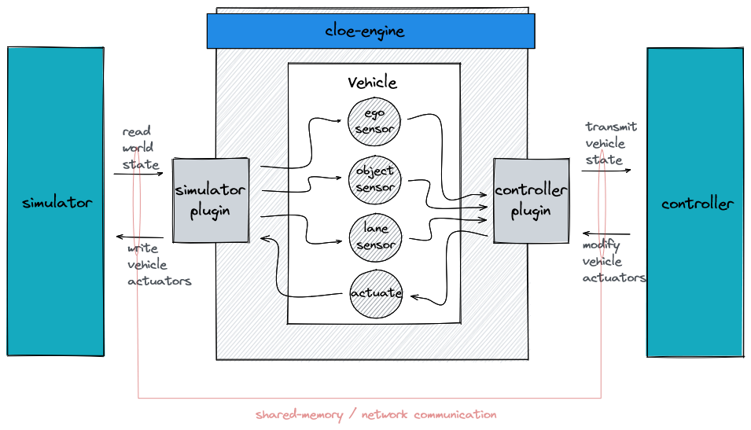

Overview
========

Cloe consists of multiple components that work together to create a system
simulation. The most significant of these are the *simulator binding*, the
*vehicle*, the *controller binding* and the *core* of Cloe itself.
Each of these will be described in detail.

Simulator (Binding)
-------------------

A simulator in which vehicles are driven can vary greatly in complexity.
It can use simple or complex models, which have significant effect on
the result of any simulation performed. Two important aspects to any
simulator for vehicles are how environment and vehicles are modelled:

- Vehicle model complexity determines how the vehicle model in the simulation
  applies values we supply to the drivetrain and the steering system.
- Environment physics determine how the vehicle acts on the driving surface and
  how the vehicle's sensing system perceives other players.

In order to accommodate different use-cases, Cloe attempts to abstract over
the differences of simulators by providing a high-level interface to a minimum
set of features. The component in a simulation that interfaces with a simulator
is called the *simulator* or *simulator binding*.

Cloe currently provides three simulator bindings:

vtd
    Interfaces with Vires VTD, which excels in scenario creation and
    manipulation, as well as visualization. A paid license is required to use
    VTD.

minimator
   A simulator binding that provides very minimal data, mainly to serve as
   a stand-in for when other simulators are not available.

nop
    A simulator binding that does absolutely nothing and provides no data,
    but can serve as a stand-in when no other simulator is available.
    This is a built-in simulator.

...
    With time, we expect more simulator bindings to be implemented and included.
    In particular, we would be happy to have bindings to open source simulators.
    In the future, a basic simulator may even be included within Cloe itself.

The simulator binding provides Cloe with a set of vehicles within a scenario
that Cloe can access. The primary way that Cloe interacts with the simulator is
through the vehicles, by reading from sensors and writing to actuators.

Vehicles
--------

A *vehicle* is one of the central abstractions provided by Cloe. Each vehicle
is somehow represented in a virtual scenario, which is provided by the simulator.

Vehicle Components
""""""""""""""""""

A vehicle contains multiple *components* [1]_, which can be used to observe or
modify the vehicle in the virtual scenario.

Generally, the following classes of components can be assumed to exist in
a vehicle:

ego sensor
    Provides information about the host vehicle itself, such as position,
    velocity, and acceleration.

world sensor
    Provides a view of the world from the perspective of the host vehicle.
    Usually, the output of a world sensor is a list of objects. These objects
    contain properties, such as type, position, velocity, and acceleration. They
    may also be augmented with type specific information.

lane sensor
    Provides information on the lanes in the road that is currently being
    driven on by the host vehicle.

actuator
    Provides an interface with which one can write desired acceleration
    and steering angle into. These are then used by the simulator to
    modify the vehicles trajectory.

...
    Components may be installed into the vehicle by the simulator binding,
    the controller, and the Cloe executer. The interface requirements for a
    component are quite minimal.

Some of these components are also available in *groundtruth* variants, others
are simply available in different forms. In particular, there may be different
kinds of actuators, and sensing the world may be provided in sensor-specific
ways, such as with a video-feed or with radar objects.

The bindings may take advantage of standard vehicle components that are defined
in the core Cloe library, especially in order to fulfill certain expected
programmatic interfaces.

Component Proxies
"""""""""""""""""

Because one of the goals of Cloe is to scale simulation up in speed and breadth,
it is not feasible to simulate the entire signal processing pipeline. Instead, we
start with perfect knowledge derived from the virtual scenario and provide
views to this perfect knowledge that is phenomenological.

For example, instead of simulating a radar, which would require highly detailed
environment models coupled with ray-tracing, we apply phenomenological effects
on the perfect objects that are read from the world sensor provided by the
simulator: ghosting, object duplication and merging, etc.

The benefit of using standard components is that it is possible to apply
*proxies* to these components that provide useful features. These proxy
components need to only fulfill the basic standard interface, and so could be
combined in a plethora of ways.

For example, let the *world sensor* fulfill the *object sensor* interface.
Further, let there be a class of *object sensor filters* that also fulfill
the object sensor interface, but require any other object sensor in order to
be constructed. A simple filter could discard 5% of its objects; it would do
this by first reading from the underlying object sensor, copying all the objects
into a local cache, and removing 5%. This filter would be constructed with the
original *default world sensor* and then take its place. Any successive access
to the default world sensor would then access the simple filter in its stead.
And in this way, we have already provided a phenomenological effect to the
otherwise perfect sensor. This technique could naturally be combined with other
filters.

Controller (Binding)
--------------------

In Cloe, the system-under-test is usually a *controller*. This can be seen as an
independent *agent* that is combined with a vehicle. The controller can read
and write to the components in a vehicle. Because almost all interesting
controllers are external to Cloe, we also speak of a *controller binding* as
the instance that interfaces with Cloe.

A vehicle can have multiple controllers attached to it, but a controller can
only be attached to a single vehicle (this makes for a 1-n relationship). This
allows for a very modular approach to controllers, which promotes simplicity
and reusability.

Cloe provides several controllers:

nop
    A controller that does absolutely nothing, but can serve as a stand-in when
    required.

basic
    A prototypical ACC, LKA, and AEB in one. As the name indicates, the
    algorithms contained in this controller are quite basic, and exist
    primarily to test Cloe itself or as a proof-of-concept.

demo_printer
    Proof-of-concept controller that prints various messages to the console or
    a file. Currently barely implemented and only used for debugging.

demo_stuck
    Test controller that slows and stops progressing at pre-configured points
    during the simulation. Used for testing Cloe.

gndtruth_extractor
    A controller that dumps sensor data into files.

virtue
    Online testing of invariants and assumptions that we make on the vehicle
    and the simulator as can be seen from the perspective of the host vehicle.

Other controllers that make sense to provide with Cloe (but have not been
implemented yet) are:

player
    Direct human control of a vehicle via the keyboard or joystick. This could
    be useful for testing other controllers by attaching it to another vehicle
    in the simulation.

recorder
    Storing observed events persistently for offline analysis or for
    verification purposes. For example, the reproducibility of the entire
    simulation from the perspective of the vehicle could be ascertained.

Cloe
----

Cloe apart from the above external components consists of the *Cloe Runtime*,
and the *Cloe Web UI*. These are fully provided by the Cloe development team.

Runtime / Core / Engine
"""""""""""""""""""""""

The core of Cloe is a library (``libcloe.so`` and ``libcloe.a``) and an
executable (``cloe-engine``), with the following parts:

engine
    Interprets configuration, loads all the rest of the components into one
    coherent simulation. Runs the simulation loop for loop, triggering each
    component at the correct time, maintaining the simulation invariants all
    the while.

server
    A JSON REST API is provided over an embedded web server. Every component
    that is part of the simulation can expose an API. These endpoints are
    primarily used by the web UI, but anyone can write a program to access
    them.

runtime
    The collection of header files and object files that are required to
    compile a controller binding or simulator binding for Cloe. This also
    includes the Cloe library.

Web User Interface
""""""""""""""""""

A separate web UI, based on React.js, connects to the JSON REST API provided by
Cloe. This allows users to interact with the simulation and the controllers
from their web browser. This is particularly valuable when running simulations
in a distributed environment.

The web UI provides (or could provide) the following main features:

- An overview of the simulation.
- Simple simulation controls, such as simulation speed.
- Graphical access to controller HMI controls.
- Basic graphs and statistics of the simulation.
- Basic rendering of the virtual scenario.

.. [1]
    The term *component* means different things in different contexts. In
    particular, Cloe consists of different system components, but a vehicle
    also has sensor and actuator components.
