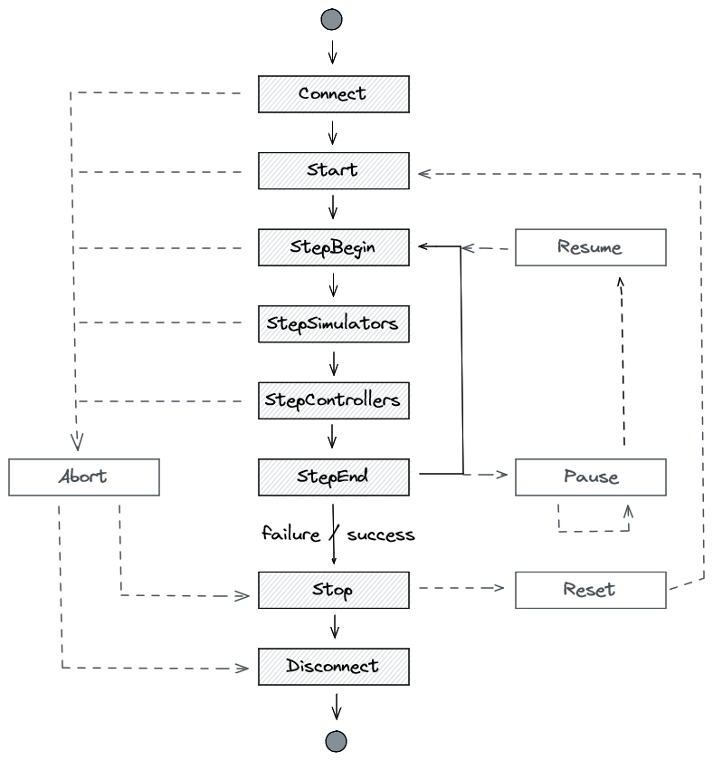

Optimizing Performance
======================

Time is of the escence. Especially if time costs you money. In this section we
will cover a few low-hanging fruits you can pluck to improve your simulation
performance.

.. highlight:: json

The first point you should consider is the statistics output from a Cloe
simulation::

    {
      "elapsed": "16.020969ms",
      "outcome": "success",
      "simulation": {
        "achievable_realtime_factor": 3069.367710251688,
        "eta": {
          "ms": 60000,
          "str": "60s"
        },
        "realtime_factor": -1.0,
        "step": 3000,
        "step_width": "20ms",
        "time": {
          "ms": 60000,
          "str": "60s"
        }
      },
      "statistics": {
        "controller_retries": {
          "count": 5998,
          "max": 0.0,
          "mean": 0.0,
          "min": 0.0,
          "sample_std_deviation": 0.0,
          "sample_variance": 0.0,
        },
        "controller_time_ms": {
          "count": 2999,
          "max": 0.007417,
          "mean": 0.0026041783927975965,
          "min": 0.001955,
          "sample_std_deviation": 0.0002609794168588151,
          "sample_variance": 6.811025602396718e-08,
        },
        "cycle_time_ms": {
          "count": 2999,
          "max": 0.027452,
          "mean": 0.004472272424141386,
          "min": 0.003784,
          "sample_std_deviation": 0.0006377127340456161,
          "sample_variance": 4.0667753116393473e-07,
        },
        "engine_time_ms": {
          "count": 3000,
          "max": 0.02149,
          "mean": 0.0002192613333333334,
          "min": 0.000188,
          "sample_std_deviation": 0.0005017647745719333,
          "sample_variance": 2.5176788900122307e-07,
        },
        "padding_time_ms": {
          "count": 2999,
          "max": 0.0,
          "mean": 0.0,
          "min": 0.0,
          "sample_std_deviation": 0.0,
          "sample_variance": 0.0,
        },
        "simulator_time_ms": {
          "count": 2999,
          "max": 0.003764,
          "mean": 0.000688565521840611,
          "min": 0.00066,
          "sample_std_deviation": 6.735377231763926e-05,
          "sample_variance": 4.536530645416388e-09,
        }
      },
      "uuid": "ad4f2854-6804-48c9-a1c9-0810abd35dc7"
    }

There are (currently) the following statistics:

- controller_retries
- controller_time_ms
- cycle_time_ms
- engine_time_ms
- padding_time_ms
- simulation_time_ms

These should be interpreted through the following diagram of the Cloe engine
state machine:

controller_retries
   Tracks how often a controller needs to be called for it to process to
   completion (the controller ``process()`` method will be called until it
   signals that it is done). Note that the count is twice as large as the
   number of steps that the simulation has; this comes from the fact that
   in this particular simulation there are two controllers.

simulator_time_ms
   Tracks how long the engine requires (in milliseconds) in the
   *StepSimulators* state, and includes the time for running all simulators
   for a single cycle.

controller_time_ms
   Tracks how long the engine requires (in milliseconds) in the
   *StepControllers* state, and includes the time for running all controllers
   for a single cycle.

padding_time_ms
   Tracks how much the engine pads (in milliseconds) the simulation to achieve
   the target realtime. This is performed in the *StepEnd* simulation state.
   You can see the final realtime factor in the JSON output. The factor -1
   indicates that no padding is used, and the expected value will then be 0 ms
   padding.

   .. note::
      The realtime factor can be modified through triggers (and therefore also
      through the web UI). These changes are not reflected in the realtime
      factor output in the simulation results. These just reflect the final
      state used on termination of the simulation.

engine_time_ms
   Tracks how long the engine requires (in milliseconds) to update various data
   structures in the *StepBegin* state. One of the most expensive steps is to
   update the web server buffer.

cycle_time_ms
   Tracks how long the engine requires (in milliseconds) to perform one full
   cycle from *StepBegin* to *StepEnd*. This should be about the size of all
   the other metrics combined.

Adjust the Realtime Factor
--------------------------

By default, Cloe will try to run the simulation in "realtime". That is, every
simulated second takes roughly one real second. The engine achieves this by
padding in the *StepEnd* simulation state.

When running simulations headless though, you probably want to simulate as fast
as possible, in which case it is recommended to set the realtime factor to -1::

   {
     "version": "4",
     "triggers": [
       {"event": "start", "action": "realtime_factor=-1"},
     ]
   }

When measuring performance of plugins, such as the simulator, please make sure
to use a realtime factor of -1, otherwise the measurement results may be
falsified by the simulator processing while Cloe is padding, skewing the
processing time for the simulator to the bottom. For example, with the VTD
simulator, simulation_time_ms shows ~10ms when the realtime factor is -1, and
~1-2ms when realtime factor is 1. This should not imply that the simulator is
more effective or performant when the realtime factor is 1! It simply means
that VTD is being triggered to perform calculation asynchronously, which it
does while the engine is padding in the *StepEnd* simulation state.

Disable the Webserver
---------------------

The web server is currently one of the performance bottlenecks in Cloe, since
every single step it fills a buffer of the results from every participant in
the simulation that are exposed via the web API. If you do not need the web
server, it is recommended that you disable it::

   {
     "version": "4",
     "server": {
       "listen": false
     }
   }

In the future, the web server backend will be swapped out and the code
refactored to minimize the bottleneck.

Profile Plugins
---------------

.. highlight:: cpp

By adding code to plugins, you can profile how long they take in different
segments. To this end, the Cloe runtime includes several utility headers that
are useful: ``cloe/utility/timer.hpp`` and ``cloe/utility/statistics.hpp``.

The timer file provides the ``DurationTimer`` class that starts measuring at
construction, and runs a function pointer (for example, a lambda) at
destruction. Thus it measures how much real time elapsed during its lifetime.
You can measure the time of a block of code by scoping it. You can also
retrieve the elapsed time by calling the ``elpased()`` method.

The statistics file provides the ``Accumulator`` class that tracks the running
statistics of inserted doubles. This class does not store the entire data set,
rather it continously updates the min/max/mean/variance of the virtual data
set, using statistical methods.

How does this look in the real world? In the ``vtd`` plugin for example,
statistics are tracked for the ``process()`` method. A struct is defined
named ``VtdStatistics`` which contains several ``Accumulator`` variables::

   struct VtdStatistics {
     cloe::utility::Accumulator frame_time_ms;
     cloe::utility::Accumulator clock_drift_ns;

     friend void to_json(cloe::Json& j, const VtdStatistics& s) {
       j = cloe::Json{
         {"frame_time_ms", s.frame_time_ms},
         {"clock_drift_ns", s.clock_drift_ns},
       };
     }
   };

The ``process()`` method contains the following lines then to insert
data::

   cloe::Duration process(const cloe::Sync& sync) final {
     timer::DurationTimer<timer::Milliseconds> t(
       [this](timer::Milliseconds d) {
         this->stats_.frame_time_ms.push_back(d.count());
       }
     );

     // [... snip ...]

     // Calculate error of previous timestep for timing statistics
     vtd_timestep_error_ = sync.time() - sensor_time;
     stats_.clock_drift_ns.push_back(static_cast<double>(vtd_timestep_error_.count()));
   }
