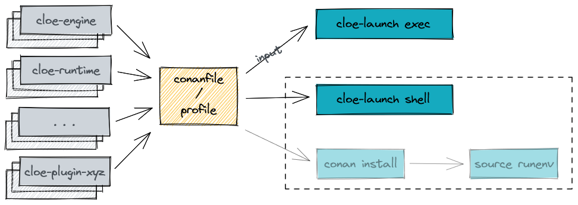

Using Cloe Launch
=================

.. highlight:: console

In the previous section we learned about Conan's virtual environment generator,
and how this can be used to run ``cloe-engine``. Conan's virtual run
environment is great, but it is an extra step that needs to be executed, and
there are some edge cases where it doesn't work. Additionally, using it
requires modifying your shell environment, which might be a problem for those
who don't want to add extra items to their PATH variable.

This is why Cloe comes with a command line wrapper for executing ``cloe-engine``
in a virtual run environment that doesn't affect your current shell. This tool
is called ``cloe-launch`` and can be installed with pip or pipx.

Installation
------------
You can install ``cloe-launch`` by running the following from the repository
root directory::

    $ make deploy-cli

You can also use one of the targets directly from the ``cli/`` directly, in
case you want to install an editable version of ``cloe-launch``.

Usage
-----

Let us recap the steps required to run ``cloe-engine`` with Conan:

#. Create Conan virtual run environment in temporary directory.
#. Create a new sub shell.
#. Source virtual run environment activate script.
#. Run ``cloe-engine`` with required arguments.
#. Remove temporary directory.
#. Exit sub shell.

Exec Command
^^^^^^^^^^^^
The steps 1-6 can be performed as one with the cloe-launch ``exec`` command:

#. Run ``cloe-launch exec`` with the input conanfile and specify
   ``cloe-engine`` arguments after ``--``.

For example::

   $ cloe-launch exec -P conantest.py -- run tests/test_minimator_smoketest.json
   {
     "elapsed": "17.837523ms",
     "outcome": "success",
     "simulation": {
       "achievable_realtime_factor": 4046.944556859571,
       "eta": {
         "ms": 60000,
         "str": "60s"
       },
       "realtime_factor": -1.0,
       "step": 3000,
       "step_width": "20ms",
       "time": {
         "ms": 60000,
         "str": "60s"
       }
     },
     [... snip ...]
   }

.. rubric:: The ``--`` argument
The ``--`` separates cloe-launch arguments and options from those that should
be passed directly to cloe-engine. If you want to see the cloe-engine
help for example, you would need to run::

   $ cloe-launch exec -P conantest.py -- --help

If you omit the ``--`` part, then you will see cloe-launch help instead.

Shell Command
^^^^^^^^^^^^^
The steps 1-3 and 5 can be performed with the cloe-launch ``shell`` command.

#. Run ``cloe-launch shell`` with the input conanfile.
#. Run ``cloe-engine`` with the required arguments.

If you pass any further arguments to the shell command (after specifying
``--``), cloe-launch will append these to the shell execution. For most shells,
``-c`` will run the following argument in the shell environment instead of
launching a new shell. This can be useful for accessing environment variables
that would be defined in the runtime shell::

   $ cloe-launch shell -P conantest.py -o:o with_vtd=True -- -c '${VTD_LAUNCH} --help'

Activate Command
^^^^^^^^^^^^^^^^
If you want to modify your current shell instead of creating a new one, you can
use the ``activate`` command::

   $ cloe-launch activate -P conantest.py
   # Please see `cloe-launch activate --help` before activating this.

   source /home/captain/.cache/cloe/launcher/167cfb520dd89cc6124d02369b3ae77632f7b6c8/activate.sh
   source /home/captain/.cache/cloe/launcher/167cfb520dd89cc6124d02369b3ae77632f7b6c8/activate_run.sh
   export CLOE_PROFILE_HASH="167cfb520dd89cc6124d02369b3ae77632f7b6c8"
   export CLOE_ENGINE="/home/captain/.conan/data/cloe-engine/0.18.0/cloe/develop/package/e228d2ea7272de48dde779ca 1121f71dc15701ef/bin/cloe-engine"
   export CLOE_PLUGIN_PATH="/home/captain/.conan/data/cloe-plugin-basic/0.18.0/cloe/develop/package/0d1d27c64c16f68e9e2954e64fcdecb7d58ac604/lib/cloe:/home/captain/.conan/data/cloe-plugin-gndtruth-extractor/0.18.0/cloe/develop/package/67f1df5a769c4e2d868b98f0321cd1276c790f54/lib/cloe:/home/captain/.conan/data/cloe-plugin-minimator/0.18.0/cloe/develop/package/8be15f1a1eb9591d8097d2eb65b0ccbbfd9cfca8/lib/cloe:/home/captain/.conan/data/cloe-plugin-mocks/0.18.0/cloe/develop/package/8be15f1a1eb9591d8097d2eb65b0ccbbfd9cfca8/lib/cloe:/home/captain/.conan/data/cloe-plugin-noisy-sensor/0.18.0/cloe/develop/package/0d1d27c64c16f68e9e2954e64fcdecb7d58ac604/lib/cloe:/home/captain/.conan/data/cloe-plugin-speedometer/0.18.0/cloe/develop/package/8be15f1a1eb9591d8097d2eb65b0ccbbfd9cfca8/lib/cloe:/home/captain/.conan/data/cloe-plugin-virtue/0.18.0/cloe/develop/package/8be15f1a1eb9591d8097d2eb65b0ccbbfd9cfca8/lib/cloe"
   export CLOE_SHELL="/home/captain/.cache/cloe/launcher/167cfb520dd89cc6124d02369b3ae77632f7b6c8/launcher_env.sh"

You can then use the ``source`` feature of your shell to integrate these
commands::

   $ source <(cloe-launch activate -P conantest.py)

Or use the ``eval`` command::

   $ eval $(cloe-launch activate -P conantest.py)

Profiles
^^^^^^^^
In general, you'll want to use a conanfile from some directory you're working
in, in which case you can specify this file with the ``-P`` (uppercase) option::

   $ cloe-launch exec -P conanfile.txt -- [cloe-engine arguments]

If you find you are using the same profile all the time, you can "bake" this
profile into the cloe-launch user configuration::

   $ cloe-launch profile add --profile my_default conanfile.txt

You can then specify it with the ``-p`` (lowercase) option::

   $ cloe-launch exec -p my_default -- [cloe-engine arguments]

And if you make it the default, you don't need to specify ``-p`` or ``-P`` at
all::

   $ cloe-launch profile default --profile my_default

You can see which profiles you have and manage them with the ``profile``
command.

.. note::
   You cannot use Python-based conanfiles as profiles that depend on files
   that are relative to the original conanfile. This is the case with
   ``conanfile.py`` and ``conantest.py`` that are in the Cloe repository,
   for example.

   If you do add such an invalid conanfile as a profile, cloe-launch will not
   complain, but you will get a Conan error.

   You can convert almost any specific use of ``conanfile.py`` into an
   equivalent ``conanfile.txt``.

Runtime Cache
^^^^^^^^^^^^^
When you run even a simple command, such as ``cloe-launch exec -- usage``,
you will notice that there is still a significant delay until cloe-engine is
run. You can minimize this by instructing cloe-launch to re-use the cache
with the ``-c`` argument. The cache contains the virtual run env based on the
profile hash, but it may be out-of-date, which is why it's not on by default.

You can use this cache for the ``exec``, ``shell``, and ``activate`` commands.

Conan Options
^^^^^^^^^^^^^
The three main commands ``exec``, ``shell``, and ``activate`` let you pass
further arguments to Conan.

For example, to instruct Conan to build any missing dependencies::

   $ cloe-launch exec -P conantest.py -o:o with_vtd=True -o --build=missing -- usage

There are three options cloe-launch provides:

``-o ARG``
   This option will pass ``ARG`` verbatim to Conan.

``-o:o ARG``
   This option will pass ``--options ARG`` to Conan.

``-o:s ARG``
   This option will pass ``--settings ARG`` to Conan.

.. note::
   The hash used for the cache is not dependent on these options, so if you
   specify any Conan options, you probably should **not** re-use the cache, or
   make sure you clean the cache before the first invocation.

Getting Help
^^^^^^^^^^^^
Once ``cloe-launch`` is available in your PATH, you can get help from the tool
itself anytime with the ``--help`` flag::

    $ cloe-launch --help
    Usage: cloe-launch [OPTIONS] COMMAND [ARGS]...

      Launch cloe-engine with profiles and manage launch profiles.

    Options:
      -v, --verbose  Print more information (mostly debugging).
      --help         Show this message and exit.

    Commands:
      activate  Launch shell with the correct environment from a profile.
      clean     Clean launcher profile cache.
      exec      Launch cloe-engine with a profile.
      profile   Manage launcher profiles.
      shell     Launch shell with the correct environment from a profile.

Troubleshooting
---------------

When you get an error from running ``cloe-launch``, it's important you read the
output to understand where the problem is. Usually, errors will come from
Conan, which is used under-the-hood.

In this case, you might see in the first few lines::

    $ cloe-launch exec -P conantest.py -- check tests/test_minimator_smoketest.json
    Error running: conan install --install-folder /home/captain/.cache/cloe/launcher/167cfb520dd89cc6124d02369b3ae77632f7b6c8 -g virtualenv conantest.py
    Configuration:
    [settings]
    arch=x86_64
    [... snip ...]

This tells us with which command the problem occurred. If we continue reading
the output looking for any error statements, we might find something::

    [... snip ...]
    cloe/0.18.0@cloe/develop: Not found in local cache, looking in remotes...
    cloe/0.18.0@cloe/develop: Trying with 'artifactory'...
    cloe/0.18.0@cloe/develop: Trying with 'conan-center'...
    ERROR: Failed requirement 'cloe/0.18.0@cloe/develop' from 'conantest.py (cloe-test/0.18.0)'
    ERROR: Unable to find 'cloe/0.18.0@cloe/develop' in remotes
    [... snip ...]

Here we find the actual source of the problem: The ``cloe`` package, which is
referred to in the profile we used (``conantest.py``), cannot be found. This
usually means you haven't built it yet, and can be dealt with the process
described in :doc:`../install`.

This is then followed by a Python traceback, which is less helpful at first
glance::

    [... snip ...]
    Traceback (most recent call last):
      File "/home/captain/.local/bin/cloe-launch", line 8, in <module>
        sys.exit(entry_point())
      File "/home/captain/.local/pipx/venvs/cloe-launch/lib/python3.6/site-packages/cloe_launch/__main__.py", line 446, in entry_point
        main()
      File "/home/captain/.local/pipx/venvs/cloe-launch/lib/python3.6/site-packages/click/core.py", line 829, in __call__
        return self.main(*args, **kwargs)
      File "/home/captain/.local/pipx/venvs/cloe-launch/lib/python3.6/site-packages/click/core.py", line 782, in main
        rv = self.invoke(ctx)
      File "/home/captain/.local/pipx/venvs/cloe-launch/lib/python3.6/site-packages/click/core.py", line 1259, in invoke
        return _process_result(sub_ctx.command.invoke(sub_ctx))
      File "/home/captain/.local/pipx/venvs/cloe-launch/lib/python3.6/site-packages/click/core.py", line 1066, in invoke
        return ctx.invoke(self.callback, **ctx.params)
      File "/home/captain/.local/pipx/venvs/cloe-launch/lib/python3.6/site-packages/click/core.py", line 610, in invoke
        return callback(*args, **kwargs)
      File "/home/captain/.local/pipx/venvs/cloe-launch/lib/python3.6/site-packages/click/decorators.py", line 33, in new_func
        return f(get_current_context().obj, *args, **kwargs)
      File "/home/captain/.local/pipx/venvs/cloe-launch/lib/python3.6/site-packages/cloe_launch/__main__.py", line 219, in cli_exec
        engine_args, use_cache=cache, debug=debug, override_env=overrides
      File "/home/captain/.local/pipx/venvs/cloe-launch/lib/python3.6/site-packages/cloe_launch/exec.py", line 603, in exec
        env = self._prepare_runtime_env(use_cache)
      File "/home/captain/.local/pipx/venvs/cloe-launch/lib/python3.6/site-packages/cloe_launch/exec.py", line 458, in _prepare_runtime_env
        self._prepare_virtualenv()
      File "/home/captain/.local/pipx/venvs/cloe-launch/lib/python3.6/site-packages/cloe_launch/exec.py", line 412, in _prepare_virtualenv
        self._run_cmd(conan_cmd, must_succeed=True)
      File "/home/captain/.local/pipx/venvs/cloe-launch/lib/python3.6/site-packages/cloe_launch/exec.py", line 639, in _run_cmd
        return run_cmd(cmd, must_succeed=must_succeed)
      File "/home/captain/.local/pipx/venvs/cloe-launch/lib/python3.6/site-packages/cloe_launch/utility.py", line 29, in run_cmd
        raise ChildProcessError()
    ChildProcessError

The Python trace is useful for developing ``cloe-launch`` and for reporting
bugs, as it lets us find the point in the code where the exception occurred and
was handled.

.. note::
   For many errors, there may not be any Python traceback. That usually
   indicates that the problem is a user error. Which errors cause tracebacks
   and which do not may be changed in future versions of ``cloe-launch``.

----

.. rubric:: Suggested Exercises
#. | Install cloe-launch locally and view the help.
   (Hint: Have a look at the ``cli/Makefile`` file in the repository.)
#. | Create a simple profile to be used with cloe-launch.
   (Hint: See :doc:`understanding-cloe-packages` for help on creating
   a ``conanfile.txt``)
#. | Run the cloe-engine ``usage`` command with the help of cloe-launch.
   (Hint: Use the ``exec`` command.)
#. | Use the global ``-vv`` argument for several cloe-launch commands.
   | Do you understand the value of the information you now see?
   (Hint: This needs to be provided *before* the command you want to execute,
   for example: ``cloe-launch -vv exec``.)
#. | Find the cloe-launch cache location for your default profile.
   | Do you recognize the contents?
   (Hint: See the output of the commands when you increase verbosity.)
